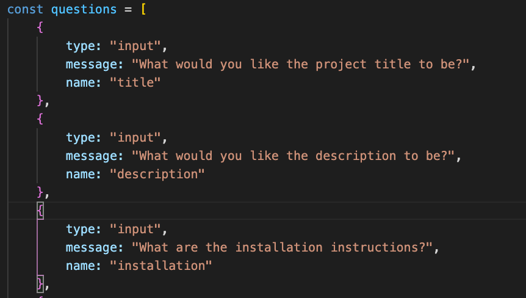

# My README Generator Project

## Table of Contents
            
- [Description](#Description)
- [Usage](#Usage)
- [License](#License)
- [Questions](#Questions)

### Description
For this project, I was tasked to create an application that will generate a readme through a series of prompts from the inquirer npm. To do this project, I started by initializing the project for npm and downloaded the inquirer package through the console. I then setup my script file with the two main requires that I would need: FS and inquirer. After that was done, I proceeded to create a list of questions that would be presented to the user for the creation of their readme.

After the questions were made, I setup a function to write the readme file regarding the responses the user made. I started by writing out the entire readme in a template literal with the user's inputs being placed in the corresponding areas. From there, I set up a switch case to choose the correct license badge. After that I finished up by placing the questions, switch case, and the file writing function all in their own modules. 

### Usage
To use this application, you need to open the project in the terminal and run node index.js to start the prompts. After you answer each prompt, your choices will be added to a prebuilt professional readme document. 

This video will show a step-by-step guide to how this is done. <a href="https://drive.google.com/file/d/1AqnOm5KSRnFG6xS5RVQLwYTI3HMR9KI3/view">Video Guide</a>

### License
This Application uses the MIT license.
### Questions
My Github: https://github.com/morrisbianco

andrewbianco98@gmail.com: Please contact me through this E-mail address with any further questions that you may have.
            